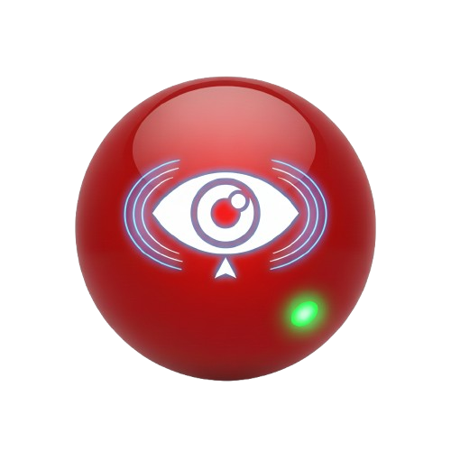

# Redball

[](https://dotnet.microsoft.com/)
[](https://www.microsoft.com/windows)
[](LICENSE)
[](https://github.com/ArMaTeC/Redball/actions/workflows/ci.yml)
[](https://github.com/ArMaTeC/Redball/actions/workflows/release.yml)
[](#code-signing)

> A system tray utility to prevent Windows from sleeping, with style.

Redball is a keep-awake utility for Windows built as a **native WPF desktop application** (.NET 8) with 12 custom themes. It keeps your computer awake using the `SetThreadExecutionState` API, with smart monitoring features (battery, network, idle, schedule, presentation mode), a built-in settings GUI, auto-updating, code signing, and a branded MSI installer.



> **[Full Documentation Wiki](https://github.com/ArMaTeC/Redball/wiki)** — Comprehensive guides for every feature, function, and configuration option.

## Features

### Modern WPF Desktop Application (.NET 8)

- **Native WPF UI** — Built with .NET 8 WPF, self-contained single-file EXE (~64MB)
- **12 Custom Themes** — System (auto-detect), Dark, Light, Midnight Blue, Forest Green, Ocean Blue, Sunset Orange, Royal Purple, Slate Gray, Rose Gold, Cyberpunk, Coffee, Arctic Frost
- **Custom Window Chrome** — Modern borderless window with custom title bar, minimize/maximize/close buttons, and rounded corners via `WindowChrome`
- **Settings Window** — Tabbed settings with live slider value labels for duration and typing speed, organized into General, Behavior, Smart Features, TypeThing, and Updates sections
- **About & Update Windows** — Built-in version info, update checker, and download progress
- **P/Invoke SendInput** — Native Windows API for typing simulation (no WinForms dependency)
- **Theme Persistence** — Selected theme saved to config and restored on startup
- **Code Signed** — EXE and MSI signed with SHA-256 certificate via `signtool` in CI

### Smart Monitoring & Automation

- **Battery-Aware Mode** — Auto-pause when battery drops below a configurable threshold, resume on charge
- **Network-Aware Mode** — Auto-pause when network disconnects, resume on reconnect
- **Idle Detection** — Auto-pause after configurable minutes of user inactivity, resume on input
- **Scheduled Operation** — Auto-start/stop at configured times and days of the week
- **Presentation Mode Detection** — Auto-activate when PowerPoint is open or Teams is screen-sharing
- **Session Restore** — Saves state on exit, restores on next startup
- **Singleton Instance** — Named mutex prevents multiple instances
- **Crash Recovery** — Detects previous abnormal termination and resets to safe defaults

### Core Features

- **Timed Sessions** — Set duration (15, 30, 60, 120 minutes) or run indefinitely
- **Display Sleep Control** — Optionally keep display awake too
- **F15 Heartbeat** — Sends invisible F15 keypresses to prevent idle detection via native `SendInput`
- **Startup with Windows** — Launch automatically via Registry Run key or MSI installer
- **Tray Notifications** — Configurable balloon tip notifications with mode filtering
- **JSON Configuration** — Persistent settings via `Redball.json`
- **Structured Logging** — Rotating log files with configurable size limits
- **Settings Backup/Restore** — Export and import all settings to a JSON backup file
- **Global Hotkey** — Ctrl+Alt+Pause to toggle pause/resume system-wide
- **Localization (i18n)** — English, Spanish, French, German, and Blade Runner theme
- **Auto-Updater** — Check for and install updates from GitHub Releases
- **Code Signing** — EXE and MSI signed with SHA-256 certificate via `signtool` in CI
- **TypeThing — Clipboard Typer** — Simulates human-like typing of clipboard contents via global hotkeys
- **MSI Installer** — WiX v4 installer with branded UI, shortcuts, and post-install launch
- **CI/CD** — GitHub Actions with Pester tests, PSScriptAnalyzer lint, WPF build, security scan, and GitHub Release creation

## Quick Start

### Prerequisites

- **Windows 10** or later
- **.NET 8 Runtime** (included in the self-contained WPF EXE — no separate install needed)

### Option A — MSI Installer (Recommended)

Download the latest **`Redball.msi`** from the [Releases](https://github.com/ArMaTeC/Redball/releases) page and run it. The MSI is code-signed and includes:

- **WPF application** — Modern themed desktop UI (`Redball.UI.WPF.exe`)
- Per-user installation to `%LocalAppData%\Redball`
- Start Menu, Desktop, and optional Startup shortcuts (all with Redball icon)
- Branded installer UI with custom banner and dialog images
- Optional default behavior features (battery-aware, network-aware, idle detection, etc.)
- "Launch Redball" checkbox on the finish page

### Option B — Run the Executable

If you have the self-contained EXE from the repository or a custom build:

```powershell
# Run the WPF application
.\Redball.UI.WPF.exe

# The application will start minimized to the system tray
# Right-click the tray icon to access all features
```

## Configuration

Settings are stored in `Redball.json` in the application directory. A default file is created on first run if one doesn't exist. You can also change all settings from the **Settings** dialog in the tray menu.

```json
{
    "HeartbeatSeconds": 59,
    "PreventDisplaySleep": true,
    "UseHeartbeatKeypress": true,
    "DefaultDuration": 60,
    "LogPath": "Redball.log",
    "MaxLogSizeMB": 10,
    "ShowBalloonOnStart": true,
    "Locale": "en",
    "MinimizeOnStart": false,
    "BatteryAware": false,
    "BatteryThreshold": 20,
    "NetworkAware": false,
    "IdleDetection": false,
    "AutoExitOnComplete": false,
    "ScheduleEnabled": false,
    "ScheduleStartTime": "09:00",
    "ScheduleStopTime": "18:00",
    "ScheduleDays": ["Monday", "Tuesday", "Wednesday", "Thursday", "Friday"],
    "PresentationModeDetection": false,
    "ProcessIsolation": false,
    "EnablePerformanceMetrics": false,
    "EnableTelemetry": false,
    "UpdateRepoOwner": "ArMaTeC",
    "UpdateRepoName": "Redball",
    "UpdateChannel": "stable",
    "VerifyUpdateSignature": false
}
```

| Setting | Description | Default |
| ------- | ----------- | ------- |
| `HeartbeatSeconds` | Interval between keep-awake refreshes and F15 keypresses | `59` |
| `PreventDisplaySleep` | Keep the display on in addition to preventing system sleep | `true` |
| `UseHeartbeatKeypress` | Send invisible F15 keypresses to prevent app-level idle detection | `true` |
| `DefaultDuration` | Default timer duration in minutes | `60` |
| `LogPath` | Path to log file | `Redball.log` |
| `MaxLogSizeMB` | Log rotation threshold in MB | `10` |
| `ShowBalloonOnStart` | Show tray notification when Redball starts | `true` |
| `Locale` | Display language (`en`, `es`, `fr`, `de`, `bl`) | Auto-detected |
| `MinimizeOnStart` | Start minimized to system tray | `false` |
| `BatteryAware` | Auto-pause when battery is low | `false` |
| `BatteryThreshold` | Battery % below which to auto-pause | `20` |
| `NetworkAware` | Auto-pause when network disconnects | `false` |
| `IdleDetection` | Auto-pause after user inactivity | `false` |
| `IdleThresholdMinutes` | Minutes of inactivity before auto-pause | `30` |
| `AutoExitOnComplete` | Exit automatically when a timed session finishes | `false` |
| `ScheduleEnabled` | Enable daily scheduled activation | `false` |
| `ScheduleStartTime` | Time to auto-start (HH:mm) | `09:00` |
| `ScheduleStopTime` | Time to auto-stop (HH:mm) | `18:00` |
| `ScheduleDays` | Days of the week the schedule applies | Weekdays |
| `PresentationModeDetection` | Auto-activate for PowerPoint/Teams presentations | `false` |
| `EnableTelemetry` | Opt-in anonymous usage telemetry (logged locally) | `false` |
| `UpdateRepoOwner` | GitHub owner for update checks | `ArMaTeC` |
| `UpdateRepoName` | GitHub repo for update checks | `Redball` |
| `UpdateChannel` | Release channel (`stable` or `beta`) | `stable` |
| `VerifyUpdateSignature` | Require valid digital signature on updates | `false` |
| `TypeThingEnabled` | Enable the clipboard typing feature | `true` |
| `TypeThingMinDelayMs` | Minimum delay between keystrokes (ms) | `30` |
| `TypeThingMaxDelayMs` | Maximum delay between keystrokes (ms) | `120` |
| `TypeThingStartDelaySec` | Countdown seconds before typing begins | `3` |
| `TypeThingStartHotkey` | Global hotkey to start typing | `Ctrl+Shift+V` |
| `TypeThingStopHotkey` | Global hotkey to stop typing | `Ctrl+Shift+X` |
| `TypeThingTheme` | Settings dialog theme (`light`, `dark`, `hacker`) | `dark` |
| `TypeThingAddRandomPauses` | Add occasional longer pauses for realism | `true` |
| `TypeThingRandomPauseChance` | Chance (%) of a random pause per character | `5` |
| `TypeThingRandomPauseMaxMs` | Maximum random pause duration (ms) | `500` |
| `TypeThingTypeNewlines` | Press Enter when a newline is encountered | `true` |
| `TypeThingNotifications` | Show tray notifications for typing events | `true` |

## Usage

### Tray Icon Menu

Right-click the red ball icon in your system tray:

| Menu Item | Description |
| --------- | ----------- |
| **Status** | Read-only status line (active state, display, F15, timer) |
| **Pause / Resume Keep-Awake** | Toggle the keep-awake state |
| **Prevent Display Sleep** | Toggle display sleep prevention |
| **Use F15 Heartbeat** | Toggle invisible F15 keypresses |
| **Stay Awake For →** | Choose duration (15 / 30 / 60 / 120 min) |
| **Stay Awake Until Paused** | Run indefinitely |
| **Battery-Aware Mode** | Toggle auto-pause on low battery |
| **Start with Windows** | Toggle startup shortcut |
| **Network-Aware Mode** | Toggle auto-pause on disconnect |
| **Idle Detection** | Toggle idle-based auto-pause |
| **TypeThing →** | Clipboard typer submenu (Type Clipboard, Stop, Status, Settings) |
| **Settings...** | Open the tabbed settings dialog |
| **About...** | Version info and update checker |
| **Exit** | Close Redball gracefully |

### Keyboard Shortcuts

| Main UI | Description |
| ------- | ----------- |
| **Title Bar** | Custom chrome with app icon, title, subtitle, and window controls (minimize, maximize, close) |
| **Navigation Panel** | Left-side navigation with Home, Analytics, Metrics, Diagnostics, Settings, Behavior, Smart Features, TypeThing, and Updates sections |
| **Content Area** | Dynamic content that changes based on selected navigation item |
| **Tray Icon** | Right-click for quick controls; left-click to toggle pause/resume |

## Command Line Arguments

The WPF application supports the following command-line arguments:

```powershell
# Start minimized to tray
.\Redball.UI.WPF.exe -minimized

# Start with specific config path
.\Redball.UI.WPF.exe -config "C:\Tools\Redball.json"
```

| Argument | Description |
| -------- | ----------- |
| `-minimized` | Start minimized to system tray |
| `-config <path>` | Specify a custom config file path |
| `-help` | Show help information |

## Settings GUI

Open the settings dialog from the tray menu (**Settings...** or press **G**). The dialog has five tabs:

- **General** — Theme, notifications, logging, minimize behavior
- **Behavior** — Display sleep prevention, heartbeat key, default duration, auto-exit
- **Smart Features** — Battery-aware, network-aware, idle detection, presentation mode, scheduled operation
- **TypeThing** — Enable/disable, typing speed, hotkeys, random pauses, newlines
- **Updates** — Update channel, signature verification, version check, notifications

Changes are saved to `Redball.json` when you click **OK**.

TypeThing also has its own dedicated settings dialog (accessible from the TypeThing tray submenu) with grouped controls for speed, behaviour, hotkeys, and appearance — including a live WPM estimate and theme preview.

## C# Services API

Redball v3.0 is implemented as a pure C# WPF application. The core functionality is organized into services:

### Core Services

| Service | Purpose |
| --------- | --------- |
| `KeepAwakeService` | Core keep-awake engine with `SetThreadExecutionState` and F15 heartbeat |
| `BatteryMonitorService` | WMI-based battery monitoring with auto-pause/resume |
| `NetworkMonitorService` | Network connectivity monitoring |
| `IdleDetectionService` | User idle detection via `GetLastInputInfo` |
| `ScheduleService` | Time/day-based scheduled activation |
| `PresentationModeService` | PowerPoint/Teams presentation detection |
| `SessionStateService` | Save/restore session state |
| `StartupService` | Windows startup registration (Registry Run key) |
| `SingletonService` | Named mutex for single instance enforcement |
| `CrashRecoveryService` | Crash flag detection and safe recovery |
| `NotificationService` | Tray balloon notifications |
| `LocalizationService` | i18n with built-in and external locale support |
| `ConfigService` | JSON configuration with export/import |
| `HotkeyService` | Global hotkey registration |
| `UpdateService` | GitHub release auto-updater |
| `Logger` | Structured logging with rotation |

### Usage Example

```csharp
// Access the KeepAwakeService singleton
var keepAwake = KeepAwakeService.Instance;

// Toggle active state
keepAwake.SetActive(!keepAwake.IsActive);

// Start a timed session
keepAwake.StartTimedAwake(TimeSpan.FromMinutes(30));

// Export settings
ConfigService.Instance.Export("backup.json");
```

## Building

### WPF Application

The WPF desktop application is built with .NET 8 as a self-contained single-file executable:

```powershell
# Publish the WPF app
dotnet publish src/Redball.UI.WPF/Redball.UI.WPF.csproj --configuration Release -o dist/wpf-publish

# Or use the comprehensive build script
.\scripts\build.ps1
```

The published EXE (~64MB) includes the .NET runtime, uses compression and native library embedding, and has embedded debug symbols (no separate PDB file).

### MSI Installer

The MSI is built with [WiX Toolset v4](https://wixtoolset.org/):

```powershell
# Full deploy pipeline (MSI via WiX, with code signing)
.\installer\Deploy-Redball.ps1

# Build MSI only
.\installer\Build-MSI.ps1 -Version "3.0.0"
```

The installer includes branded UI images (custom banner and dialog backgrounds) and the Redball icon on all shortcuts.

### Build Script

The `build.ps1` script (located in `scripts/`) provides a comprehensive build pipeline:

```powershell
# Full build (version from version.txt)
.\scripts\build.ps1

# Specific tasks
.\scripts\build.ps1 -SkipTests    # Skip Pester tests
.\scripts\build.ps1 -SkipLint      # Skip PSScriptAnalyzer
.\scripts\build.ps1 -SkipWPF      # Skip WPF build
```

### Version Management

Version is defined in two places (kept in sync by `scripts/Bump-Version.ps1`):

1. `src/Redball.UI.WPF/Redball.UI.WPF.csproj` — `<Version>`, `<FileVersion>`, `<AssemblyVersion>`
2. `scripts/version.txt` — fallback version

### Code Signing

Both the EXE and MSI are automatically code-signed during CI releases:

- **Algorithm**: SHA-256 with RSA 2048-bit key
- **Timestamping**: DigiCert RFC 3161 timestamp server
- **Tool**: Windows SDK `signtool.exe`
- **Secrets**: `CODE_SIGNING_CERT` (base64 PFX) and `CODE_SIGNING_PASSWORD` stored as GitHub repository secrets

To use your own certificate, set the GitHub secrets:

```powershell
# Base64-encode your PFX certificate
$base64 = [Convert]::ToBase64String([IO.File]::ReadAllBytes("your-cert.pfx"))
$base64 | gh secret set CODE_SIGNING_CERT --repo YourOrg/Redball
"your-password" | gh secret set CODE_SIGNING_PASSWORD --repo YourOrg/Redball
```

If no certificate secrets are configured, the CI creates a self-signed development certificate as a fallback.

### CI/CD

GitHub Actions workflows (all using Node.js 24-compatible actions):

- **`ci.yml`** — On push/PR: runs WPF build, Pester tests (legacy), JSON validation, and security scan
- **`release.yml`** — On push to `main`: auto-tags version, publishes WPF app, signs EXE, builds branded MSI with WiX, signs MSI, creates GitHub Release with MSI attached

## Architecture

Redball v3.0 is a **pure C# WPF application** — all functionality runs natively with no PowerShell dependency.

```text
src/Redball.UI.WPF/
├── Interop/NativeMethods.cs          # All Win32 P/Invoke declarations
├── Services/
│   ├── KeepAwakeService.cs           # Core engine (SetThreadExecutionState + F15)
│   ├── BatteryMonitorService.cs      # WMI battery monitoring
│   ├── NetworkMonitorService.cs      # Network connectivity monitoring
│   ├── IdleDetectionService.cs       # GetLastInputInfo idle detection
│   ├── ScheduleService.cs            # Time/day scheduled activation
│   ├── PresentationModeService.cs    # PowerPoint/Teams/Windows detection
│   ├── SessionStateService.cs        # Session save/restore
│   ├── StartupService.cs             # Windows startup (Registry Run key)
│   ├── SingletonService.cs           # Named mutex singleton
│   ├── CrashRecoveryService.cs       # Crash flag detection
│   ├── NotificationService.cs        # Tray balloon notifications
│   ├── LocalizationService.cs        # i18n (en, es, fr, de, bl)
│   ├── ConfigService.cs              # JSON config with export/import
│   ├── HotkeyService.cs              # Global hotkey registration
│   ├── UpdateService.cs              # GitHub release auto-updater
│   └── Logger.cs                     # Structured logging with rotation
├── ViewModels/MainViewModel.cs       # MVVM state + commands
├── Views/                            # MainWindow, SettingsWindow, AboutWindow
├── Themes/                           # 12 theme XAML dictionaries
├── App.xaml.cs                       # Entry point + service orchestration
└── Redball.UI.WPF.csproj             # .NET 8 WPF project
```

### Component Flow

1. **Startup** — Singleton mutex → crash recovery → load config → init theme → init KeepAwakeService → restore session → create tray icon → register hotkeys
2. **Heartbeat Timer** — Fires every N seconds: re-assert `SetThreadExecutionState` + send F15 keypress via `SendInput`
3. **Duration Timer** — Fires every 1s: check timed expiry, idle (1s), battery/network/presentation (10s), schedule (30s)
4. **Settings Save** — `KeepAwakeService.ReloadConfig()` syncs all monitor settings immediately
5. **Shutdown** — Save session state → dispose KeepAwakeService → clear crash flag → release mutex → exit

## Troubleshooting

### Tray icon not appearing

- Check Windows notification area settings → "Select which icons appear on the taskbar"
- Click "Show hidden icons" (the `^` arrow) in the system tray
- Restart Windows Explorer if needed: `Stop-Process -Name explorer -Force`

### System still sleeps

- Check Windows power plan settings (some plans override API calls)
- Ensure no group policy is overriding `SetThreadExecutionState`
- Try enabling **Prevent Display Sleep** in the tray menu
- Try enabling **Process Isolation** in Settings → Advanced

### Multiple instances conflict

Redball uses a named mutex to enforce a single instance. If a stale instance is detected, it will attempt to stop it automatically. If that fails:

```powershell
# Find and stop Redball processes manually
Get-Process Redball | Stop-Process -Force
```

### Log file locked

If the log file is locked by a previous instance, Redball automatically retries with exponential backoff and falls back to `%TEMP%\Redball_fallback.log`.

## Contributing

1. Fork the repository
2. Create a feature branch (`git checkout -b feature/amazing-feature`)
3. Make your changes
4. Build and test (`dotnet build src/Redball.UI.WPF`)
5. Commit your changes (`git commit -m 'Add amazing feature'`)
6. Push to the branch (`git push origin feature/amazing-feature`)
7. Open a Pull Request

### Development Setup

```powershell
git clone https://github.com/ArMaTeC/Redball.git
cd Redball

# Build the WPF application
dotnet build src/Redball.UI.WPF/Redball.UI.WPF.csproj

# Run in development mode
dotnet run --project src/Redball.UI.WPF/Redball.UI.WPF.csproj

# Build installer locally
.\installer\Deploy-Redball.ps1 -BuildMsi
```

## Roadmap

- [x] Keyboard shortcuts (tray menu access keys)
- [x] Multiple language support (i18n — en, es, fr, de)
- [x] GUI configuration editor (tabbed settings dialog)
- [x] MSI installer (WiX v4 with feature selection)
- [x] Auto-start with Windows
- [x] Network-aware mode
- [x] Dark mode detection
- [x] High contrast / High DPI awareness
- [x] PowerShell Core (7.x) compatibility (legacy, archived in `legacy/`)
- [x] Battery-aware mode
- [x] Idle detection
- [x] Scheduled operation
- [x] Presentation mode detection
- [x] Session restore
- [x] Toast notifications
- [x] Auto-updater (GitHub Releases)
- [x] Code signing support
- [x] Singleton instance management
- [x] Crash recovery
- [x] Process isolation (legacy PowerShell feature)
- [x] Settings backup/restore
- [x] Global hotkey (Ctrl+Alt+Pause)
- [x] CI/CD (GitHub Actions)
- [x] Performance metrics
- [x] TypeThing clipboard typer with global hotkeys
- [x] About dialog with update checker
- [x] Themed TypeThing settings dialog (light/dark/hacker)
- [x] Modern WPF desktop application (.NET 8)
- [x] 12 custom UI themes (Midnight Blue, Cyberpunk, Rose Gold, etc.)
- [x] P/Invoke SendInput (replaced WinForms SendKeys)
- [x] Self-contained compressed EXE (~64MB, down from 150MB)
- [x] Branded MSI installer UI (custom banner/dialog images)
- [x] Automated code signing (EXE + MSI) in CI
- [x] Comprehensive build system (`build.ps1`)
- [x] Version management script (`Bump-Version.ps1`)
- [x] Node.js 24-compatible GitHub Actions (v5)

## License

This project is licensed under the MIT License — see the [LICENSE](LICENSE) file for details.

**Manufacturer:** ArMaTeC

## Acknowledgments

- Icon design using System.Drawing GDI+ path gradients
- [.NET 8 / WPF](https://dotnet.microsoft.com/) for the modern desktop application
- [WiX Toolset v4](https://wixtoolset.org/) for the MSI installer
- Windows SDK `signtool.exe` for code signing

## Support

- [Report bugs](https://github.com/ArMaTeC/Redball/issues)
- [Request features](https://github.com/ArMaTeC/Redball/issues)
- [Discussions](https://github.com/ArMaTeC/Redball/discussions)
